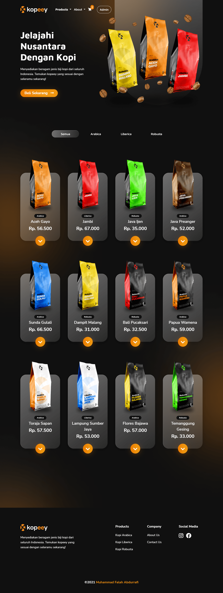

# Kopeey
Kopeey menyediakan beragam jenis biji kopi dari seluruh wilayah di Indonesia yang memiliki karakteristiknya masing-masing. Mulai dari jenis Arabica, Robusta, hingga Liberica. Tersedia juga pilihan kopi bubuk selain kopi dalam bentuk biji, yaitu Coarse (Kasar), Medium (Sedang), dan Fine (Halus). Kopi yang kami kirim selalu berkualitas dan dalam keadaan fresh setelah roasting.

## :globe_with_meridians: Live
<a href="https://kopeey.rf.gd" target="_parent">kopeey.rf.gd</a>
 

## :mag_right: Preview Image
 
